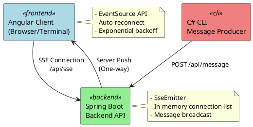
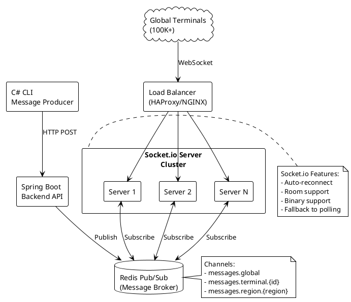
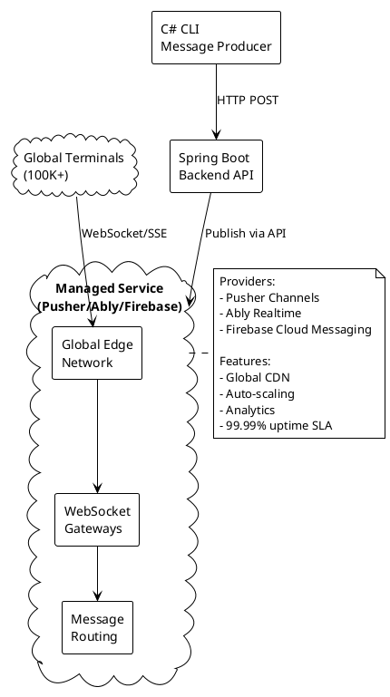
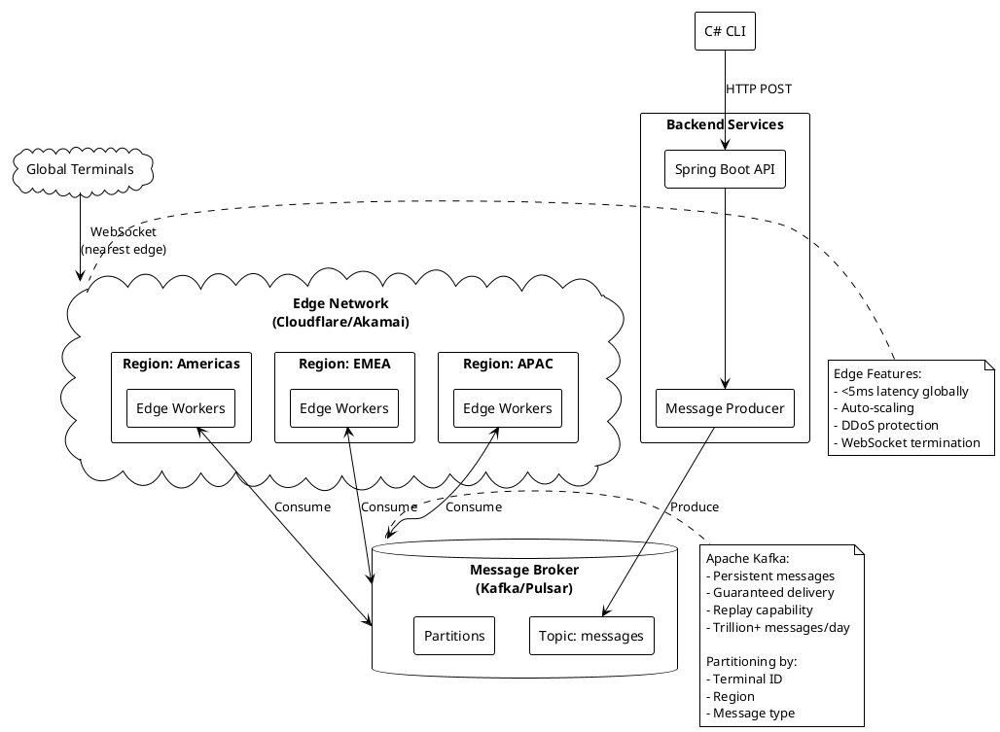
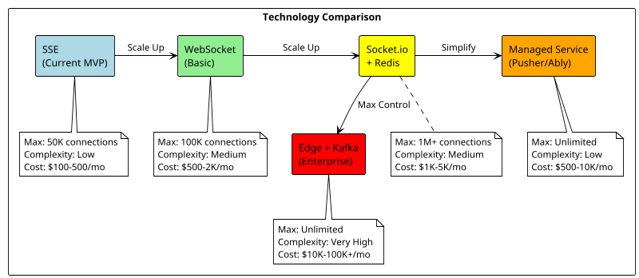
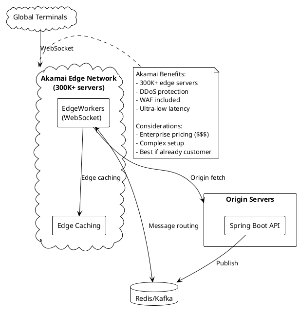

# Real-Time Messaging Architecture for Global Terminal Network

## 📋 Overview

This document outlines the architecture and technology choices for delivering real-time messages to **hundreds of thousands of connected terminals globally**. It covers the current MVP implementation using Server-Sent Events (SSE) and provides detailed guidance on production-ready solutions for massive scale.

---

## 🏗️ Current Architecture (MVP)

The current implementation uses **Server-Sent Events (SSE)** for real-time one-way communication from server to clients.

### Technology Stack
- **Frontend**: Angular with SSE client (auto-reconnect with exponential backoff)
- **Backend**: Spring Boot with SSE emitters
- **Message Producer**: C# CLI for sending messages



### ⚠️ SSE Limitations for Large Scale

| Issue | Impact | Limit |
|-------|--------|-------|
| **HTTP/1.1 Connections** | Each client = 1 open connection | ~10K-50K max |
| **Memory Usage** | ~1-2KB per connection minimum | High memory footprint |
| **Load Balancing** | Requires sticky sessions | Complex horizontal scaling |
| **Message Guarantees** | No persistence or acknowledgment | Lost messages on disconnect |
| **Browser Limits** | 6 connections per domain | Client-side bottleneck |

**Verdict**: SSE is suitable for **up to ~50,000 concurrent connections** with proper infrastructure, but struggles beyond that.

---

## 🎯 Production-Ready Solutions for Massive Scale

### Option 1: WebSocket + Redis Pub/Sub (Recommended for Most Cases)

**Scalability**: Handles **100K - 1M+ connections** with horizontal scaling



**Key Components**:
- **Socket.io**: WebSocket library with fallback support
- **Redis**: Message broker for cross-server communication
- **Load Balancer**: Distributes connections across servers

**Implementation**:
```bash
# Add Socket.io server (Node.js)
npm install socket.io socket.io-redis

# Configure Redis adapter for horizontal scaling
const io = require('socket.io')(server);
const redisAdapter = require('socket.io-redis');
io.adapter(redisAdapter({ host: 'localhost', port: 6379 }));
```

**Pros**:
- ✅ Battle-tested at scale
- ✅ Horizontal scaling (add more servers)
- ✅ Low latency (<100ms)
- ✅ Full-duplex communication
- ✅ Cost-effective

**Cons**:
- ❌ Requires managing Socket.io servers
- ❌ Redis cluster setup for high availability
- ❌ More complex than SSE

---

### Option 2: Managed WebSocket Service (Easiest Production Solution)

**Scalability**: Handles **millions of connections** out-of-the-box



**Popular Providers**:

| Provider | Pricing Model | Max Scale | Best For |
|----------|--------------|-----------|----------|
| **Pusher Channels** | $49-499/mo + overages | Millions | Web/mobile apps |
| **Ably** | $29-399/mo + overages | Billions | Enterprise, IoT |
| **Firebase FCM** | Free tier + pay-as-you-go | Billions | Mobile/web push |
| **AWS IoT Core** | $1/million messages | Billions | IoT devices |

**Implementation** (Pusher example):
```java
// Spring Boot - Publish message
Pusher pusher = new Pusher(appId, key, secret);
pusher.trigger("terminal-channel", "new-message", message);
```

```typescript
// Angular - Subscribe
const pusher = new Pusher('YOUR_KEY');
const channel = pusher.subscribe('terminal-channel');
channel.bind('new-message', (data) => {
  console.log('Message received:', data);
});
```

**Pros**:
- ✅ Zero infrastructure management
- ✅ Global edge network
- ✅ Proven at massive scale
- ✅ Built-in analytics/monitoring
- ✅ Fast deployment (hours, not weeks)

**Cons**:
- ❌ Ongoing costs (can be significant)
- ❌ Vendor lock-in
- ❌ Less control over infrastructure

---

### Option 3: Edge Computing + Message Broker (Enterprise Scale)

**Scalability**: **Unlimited** - handles millions to billions



**Technology Stack**:
- **Edge**: Cloudflare Workers / Akamai EdgeWorkers
- **Message Broker**: Apache Kafka / Apache Pulsar
- **Backend**: Spring Boot (message producer)

**When to Use**:
- 🏢 Enterprise with >500K terminals
- 🌍 Global distribution critical
- 💰 Budget for infrastructure
- 🔒 Compliance/data sovereignty requirements

**Pros**:
- ✅ Unlimited scalability
- ✅ Ultra-low latency globally
- ✅ Message persistence & replay
- ✅ Exactly-once delivery guarantees
- ✅ Full control

**Cons**:
- ❌ High complexity
- ❌ Significant operational overhead
- ❌ Requires dedicated DevOps team
- ❌ Expensive ($10K-100K+/month)

---

## 📊 Technology Comparison Matrix

### Scalability vs Complexity



### Feature Matrix

| Feature | SSE | WebSocket | Socket.io + Redis | Managed Service | Edge + Kafka |
|---------|-----|-----------|-------------------|-----------------|--------------|
| **Max Connections** | 50K | 100K | 1M+ | Unlimited | Unlimited |
| **Latency** | <100ms | <50ms | <100ms | <200ms | <10ms |
| **Bi-directional** | ❌ | ✅ | ✅ | ✅ | ✅ |
| **Auto-reconnect** | ✅* | ❌* | ✅ | ✅ | ✅ |
| **Message Persistence** | ❌ | ❌ | ⚠️ | ✅ | ✅ |
| **Horizontal Scaling** | ⚠️ | ⚠️ | ✅ | ✅ | ✅ |
| **Setup Time** | 1 day | 2-3 days | 1 week | 1 day | 1-2 months |
| **Operational Complexity** | Low | Medium | Medium | Very Low | Very High |
| **Monthly Cost (100K)** | $200 | $500 | $2K | $1-5K | $20K+ |

\* *Requires custom implementation*

---

## 🚀 Migration Path

### Phase 1: Current State (SSE MVP) ✅
**Status**: Complete
- Angular client with auto-reconnect
- Spring Boot SSE backend
- C# CLI message producer

### Phase 2: Proof of Concept (Socket.io + Redis)
**Timeline**: 2-3 weeks
**Goal**: Validate WebSocket performance with 10K simulated connections

1. Set up Socket.io server (Node.js)
2. Configure Redis for pub/sub
3. Integrate with existing Spring Boot backend
4. Load test with 10K concurrent connections
5. Measure latency and resource usage

### Phase 3: Production Pilot (Managed Service)
**Timeline**: 1 week
**Goal**: Deploy to 1,000 real terminals in one region

1. Choose provider (Pusher/Ably)
2. Integrate Angular client
3. Update Spring Boot to publish via provider API
4. Monitor for 2 weeks
5. Collect metrics and feedback

### Phase 4: Global Rollout
**Timeline**: 4-8 weeks
**Goal**: Support 100K+ terminals globally

**Option A: Self-hosted**
- Deploy Socket.io cluster (3-5 servers)
- Redis cluster (3-node minimum)
- Load balancer setup
- Monitoring stack (Prometheus/Grafana)

**Option B: Managed**
- Scale up Pusher/Ably plan
- Configure regional channels
- Set up analytics
- Implement rate limiting

---

## 🏢 Akamai Integration

### Akamai EdgeWorkers for WebSocket

If already using Akamai for CDN, you can leverage **EdgeWorkers** for WebSocket termination at the edge.



**When to Use Akamai**:
- ✅ Already using Akamai for CDN
- ✅ Enterprise budget available
- ✅ Need DDoS protection + WAF
- ✅ Global low-latency critical

**Alternatives**:
- **Cloudflare Workers + Durable Objects**: Similar to Akamai but cheaper
- **AWS CloudFront + Lambda@Edge**: AWS ecosystem integration
- **Fastly Compute@Edge**: Developer-friendly edge computing

---

## 💡 Recommendations by Use Case

### 🎯 For "Western Union POS Terminal" Network

**Recommended Solution**: **Managed Service (Pusher or Ably)**

**Why**:
1. ✅ Proven reliability (99.99% uptime)
2. ✅ Global edge network (low latency everywhere)
3. ✅ Fast deployment (days, not months)
4. ✅ Built-in monitoring and analytics
5. ✅ Focus on business logic, not infrastructure

**Architecture**:
```
POS Terminal → Nearest Edge Location → Pusher/Ably → Your Spring Boot API
```

**Estimated Costs** (100K terminals, 1M messages/day):
- **Pusher**: ~$2,000-5,000/month
- **Ably**: ~$1,000-4,000/month
- **AWS IoT Core**: ~$1,000/month (pay-as-you-go)

### 🏗️ For Large Enterprise (500K+ terminals)

**Recommended Solution**: **Edge Computing + Kafka**

**Why**:
- Full control over data
- Compliance/security requirements
- Predictable costs at scale
- Message replay and audit logs

### 💻 For Startups/Prototypes

**Recommended Solution**: **Keep SSE** or upgrade to **Firebase**

**Why**:
- Low/no cost to start
- Fast iteration
- Worry about scale when you have it

---

## 🔧 Quick Start Guides

### Option 1: Upgrade to Socket.io + Redis

```bash
# 1. Install Socket.io server
mkdir socketio-server && cd socketio-server
npm init -y
npm install express socket.io socket.io-redis redis

# 2. Create server (server.js)
const express = require('express');
const http = require('http');
const socketIo = require('socket.io');
const redisAdapter = require('socket.io-redis');

const app = express();
const server = http.createServer(app);
const io = socketIo(server, {
  cors: { origin: '*' }
});

// Configure Redis adapter
io.adapter(redisAdapter({ host: 'localhost', port: 6379 }));

// Handle connections
io.on('connection', (socket) => {
  console.log('Terminal connected:', socket.id);
  
  socket.on('disconnect', () => {
    console.log('Terminal disconnected:', socket.id);
  });
});

// Listen for messages from Redis
const Redis = require('ioredis');
const sub = new Redis();
sub.subscribe('messages');
sub.on('message', (channel, message) => {
  io.emit('message', message);
});

server.listen(3000, () => {
  console.log('Socket.io server running on port 3000');
});

# 3. Update Spring Boot to publish to Redis
// Add dependency: spring-boot-starter-data-redis
@Autowired
private RedisTemplate<String, String> redisTemplate;

public void sendMessage(String message) {
    redisTemplate.convertAndSend("messages", message);
}

# 4. Update Angular client
npm install socket.io-client

// In your service
import { io } from 'socket.io-client';

const socket = io('http://localhost:3000');
socket.on('message', (data) => {
  console.log('Message:', data);
});
```

### Option 2: Use Pusher (Managed Service)

```bash
# 1. Sign up at pusher.com and get credentials

# 2. Add to Spring Boot
// pom.xml
<dependency>
    <groupId>com.pusher</groupId>
    <artifactId>pusher-http-java</artifactId>
    <version>1.3.1</version>
</dependency>

// Java
Pusher pusher = new Pusher(appId, key, secret);
pusher.trigger("terminal-channel", "message", message);

# 3. Add to Angular
npm install pusher-js

// TypeScript
import Pusher from 'pusher-js';

const pusher = new Pusher('YOUR_KEY', {
  cluster: 'us2'
});

const channel = pusher.subscribe('terminal-channel');
channel.bind('message', (data) => {
  console.log('Message:', data);
});
```

---

## 📖 Additional Resources

### Documentation
- [Socket.io Scaling Guide](https://socket.io/docs/v4/using-multiple-nodes/)
- [Pusher Channels Docs](https://pusher.com/docs/channels/)
- [Ably Realtime Docs](https://ably.com/docs)
- [AWS IoT Core](https://docs.aws.amazon.com/iot/)
- [Apache Kafka Docs](https://kafka.apache.org/documentation/)

### Performance Benchmarks
- [WebSocket vs SSE Performance](https://ably.com/blog/websockets-vs-sse)
- [Socket.io Benchmark Results](https://socket.io/docs/v4/performance/)
- [Pusher Scale Tests](https://blog.pusher.com/pusher-scale-tests/)

### Architecture Patterns
- [Event-Driven Architecture](https://martinfowler.com/articles/201701-event-driven.html)
- [Microservices Messaging Patterns](https://microservices.io/patterns/data/event-driven-architecture.html)

---

## 🤝 Contributing

This architecture is evolving. Contributions and feedback welcome!

### Current Status
- ✅ MVP with SSE complete
- ⏳ WebSocket migration planned
- 📋 Load testing pending

---

## 📝 License

MIT License

---

**Last Updated**: November 2025  
**Maintained By**: Antigravity and Dariusz Danielewski
